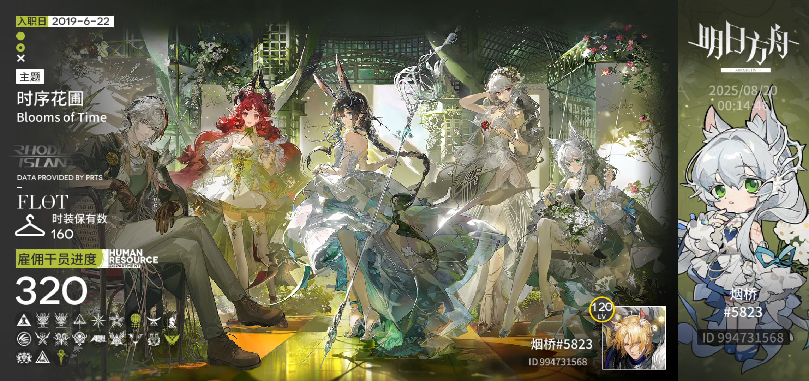

# Hi,there is seborid,a CUMT's cser. 👋
这里是seborid，CUMT's cser。  
代码苦手，安卓开发攻略中...  
喜欢玩明日方舟，ID：994731568  

 languages and Frameworks  

  

Tools   

 OS  

<!--
**seborid/seborid** is a ✨ _special_ ✨ repository because its `README.md` (this file) appears on your GitHub profile.

Here are some ideas to get you started:

- 🔭 I’m currently working on ...
- 🌱 I’m currently learning ...
- 👯 I’m looking to collaborate on ...
- 🤔 I’m looking for help with ...
- 💬 Ask me about ...
- 📫 How to reach me: ...
- 😄 Pronouns: ...
- ⚡ Fun fact: ...
-->

